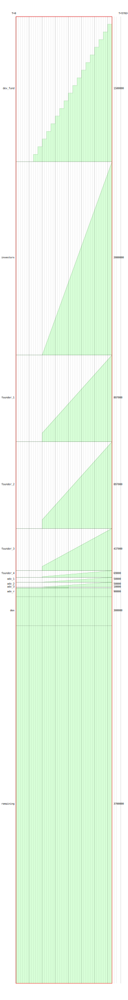

# SIENNA


* `fadroma` - smart contract macro library
* `token` - standard SNIP20 token
* `mgmt` - vesting management contract
* `schedule` - vesting schedule
* **TODO** `kukumba` - BDD macro library

## Quick start

```
git clone --recurse-submodules git@github.com:hackbg/sienna-secret-token.git
cargo test
cd mgmt
make compile-optimized-reproducible
# you know what TODO deploy.js
```

## Vesting schedule


