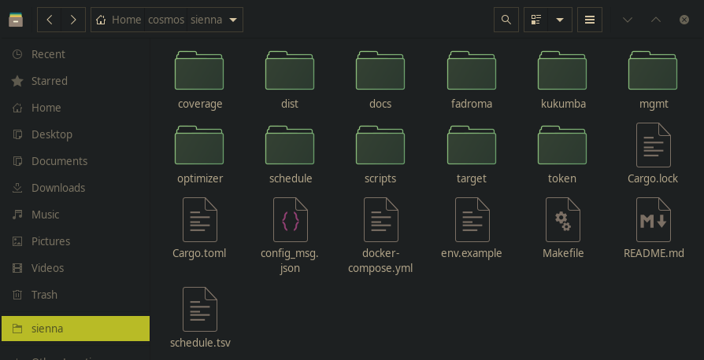
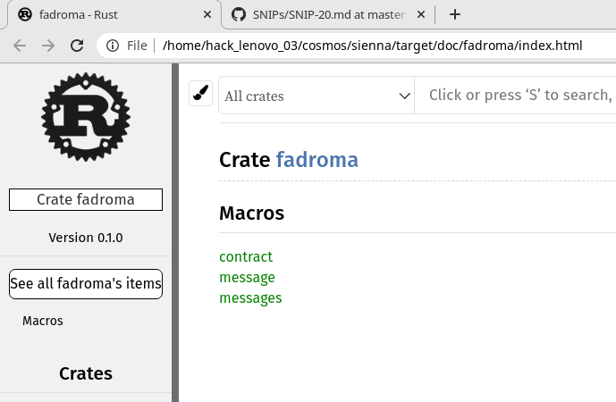
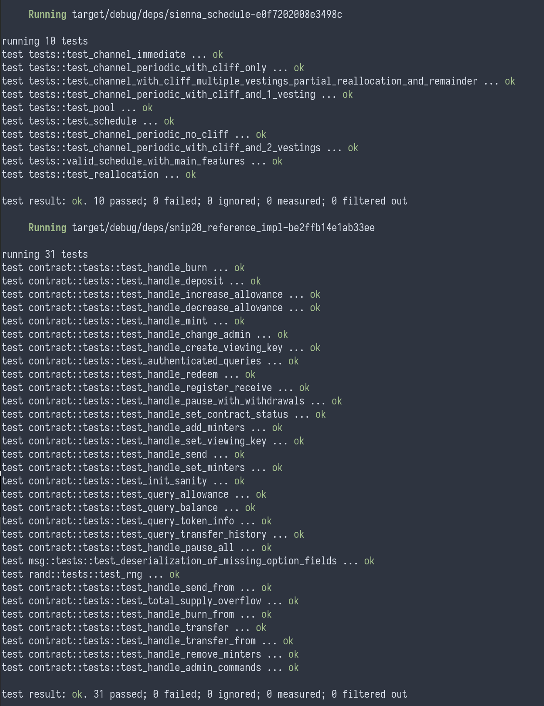
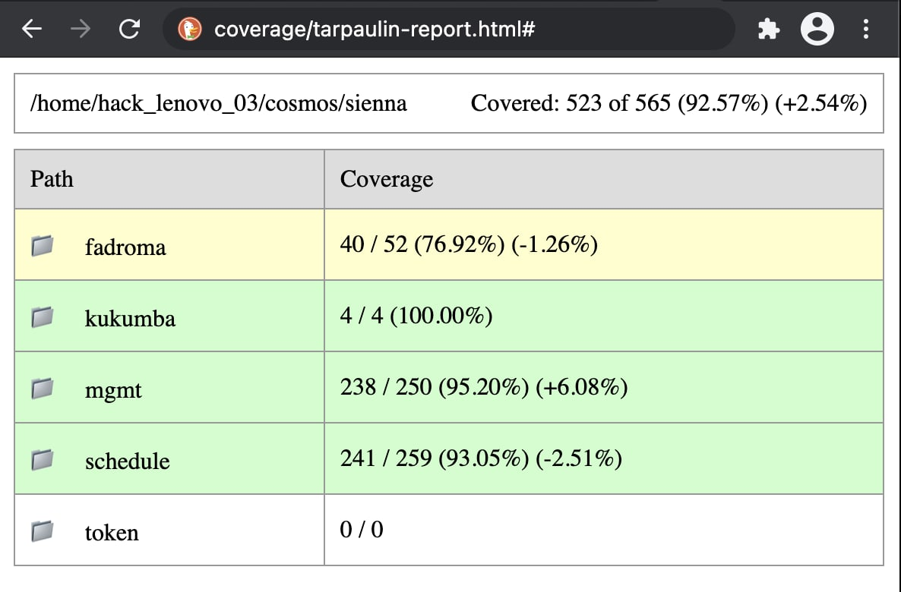
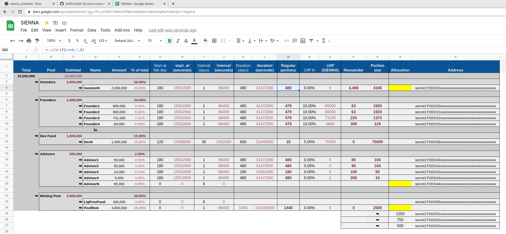

# SIENNA

## Quick start

```sh
git clone --recurse-submodules git@github.com:hackbg/sienna-secret-token.git sienna 
cd sienna        # enter repository
yarn             # install dependencies of build scripts
make test        # run tests
cargo doc --open # view documentation (needs code to compile)
make coverage    # generate test coverage reports (needs all tests to pass)
make             # compile a production build
ls dist/         # view build results
cat dist/checksums.sha256.txt # view production build checksums
```

## API documentation

## Overview of project contents 



* `Makefile` is the entry point of the project,
  and defines shorthands for most common operations.
* `Cargo.toml` defines the root workspace for all Rust modules.
* `package.json` dependencies of Node.js scripts
* `optimizer` - vendored copy of cosmwasm smart contract optimizer
* `kukumba` - bdd testing framework
* `fadroma` - smart contract macro library
* `token` - standard [SNIP20](https://github.com/SecretFoundation/SNIPs/blob/master/SNIP-20.md) token
* `mgmt` - vesting management contract
* `schedule` - model of the client's vesting logic
* `coverage`  - test coverage report

## Contract lifecycle

### 🔍 Validate the contract - `make docs`, `make test`, `make coverage`

* `make docs` compiles the API documentation.
  `cargo doc --open` builds the API documentation and opens it in your browser.
  Crates of interest include:
  * `target/doc/sienna_schedule`
  * `target/doc/sienna_mgmt`
  * `target/doc/snip20_reference_impl`
  * `target/doc/secret_toolkit_snip20`
  * `target/doc/cosmwasm_std`
  * `target/doc/cosmwasm_storage`



* `make test` runs the test suites of all modules.
  If you can't get the contract to build in your OS's environment,
  try `make test-docker` to run tests in a Docker container.



* `make coverage` generates a test coverage report
  if you provide a working installation of [tarpaulin](https://crates.io/crates/cargo-tarpaulin).



### ✏️ Configure the contract

The file `config.json` contains the specific vesting parameters
and is used to configure the contract before launching.
To generate it, go to [the spreadsheet](https://docs.google.com/spreadsheets/d/1sgj-nTE_b25F8O740Av7XYByOzkD0qNx1Jk63G2qRwY/)
that defines the vesting schedule.



* Download it as TSV using **File->Download->Tab-separated values (.tsv, current sheet)**
* Replace `schedule.tsv` with the downloaded file (renaming it from e.g. `SIENNA - Schedule.tsv`)
* Make sure that `scripts/node_modules` is up to date (run `npm install` or `yarn` in `scripts`)
* Run `make config` or `./scripts/tsv2json.js` to obtain an up-to-date `config.json`.
* Don't forget to update the screenshot here if you commit the new `schedule.tsv` and `config.json` :)

### 🗝️ Prepare for deployment

Create a file called `.env` in the repository root, and populate it with
the node URL, the chain ID, and mnemonic of the wallet who will be the
initial contract admin:

```sh
cp env.example .env
$EDITOR .env # edit this file
```

### 🚚 Deploy - `make && make deploy`

* Run `make` to generate the production binaries in `dist/`.
* Run `make deploy` to deploy the SNIP20 token and associated management contract
  to the network specified in `.env`.
* This will append the addresses of the deployed contracts to your `.env` file,
  so that subsequent commands will work with the last deployed instance of the contract.

### 🔧 Update the configuration - `make schedule && make config`

* The contract instance can be reconfigured before launch.
* Run `make schedule` to generate an up-to-date `config.json` from `schedule.tsv`.
* Run `make configure` to upload the schedule to the contract put in `.env` by `make deploy`.
  If the contract is not launched and your `.env` file contains the keys to its admin account,
  the contract's configuration will be updated.

### 🚀 Launch the contract - `make launch && make status`

* The contract can be launched only once.
* `make launch` will mint the tokens and remove all minters from the underlying SNIP20 token,
  after which The contract will irreversibly enter the `Launched` state and vesting will commence.
* `make status` can be used to monitor the status of the contract

### 💰 Vesting - `make claim`

* After launching the contract, claims can now be made to it.
* If there's an amount unlocked for the claiming address, it will be received.
