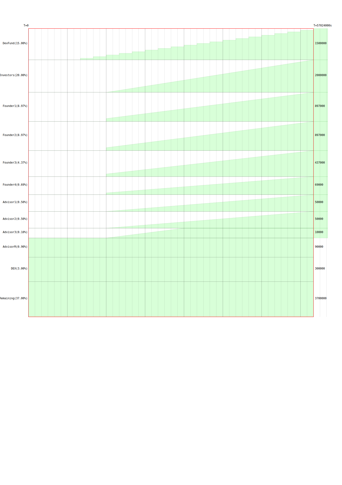

# SIENNA

* `docs`      - documentation generation
* `deployer`  - deploy scripts
* `optimizer` - build tool
* `mgmt`      - vesting management contract
* `token`     - standard SNIP20 token
* `fadroma`   - smart contract macro library
* `kukumba`   - BDD macro library

## Quick start

```
git clone --recurse-submodules git@github.com:hackbg/sienna-secret-token.git
cargo test
cd mgmt
make compile-optimized-reproducible
# you know what TODO deploy.js
```

## Vesting schedule


