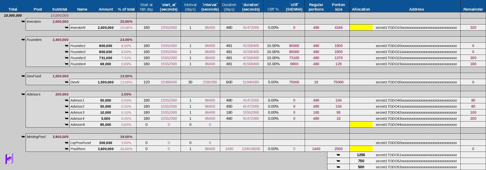

# SIENNA

## Quick start

```sh
git clone --recurse-submodules git@github.com:hackbg/sienna-secret-token.git sienna 
cd sienna        # enter repository
make test        # run tests
cargo doc --open # view documentation (needs code to compile)
make coverage    # generate test coverage reports (needs all tests to pass)
make             # compile a production build
ls dist/         # view build results
cat dist/checksums.sha256.txt # view production build checksums
```

## API documentation

By running `cargo doc --open` you can get an overview of most of the Rust
code involved in this project.


Crates of interest include:
* `target/doc/sienna_schedule`
* `target/doc/sienna_mgmt`
* `target/doc/snip20_reference_impl`
* `target/doc/secret_toolkit_snip20`
* `target/doc/cosmwasm_std`
* `target/doc/cosmwasm_storage`

## Overview of project contents 


* `Makefile` is the entry point of the project,
  and defines shorthands for most common operations.
* `Cargo.toml` defines the root workspace for all Rust modules.
* `scripts/package.json` dependencies of Node.js scripts
* `scripts/tsv2json.js` generates `config_msg.json`, see below
* `scripts/deploy.js` deploys a new blank instance of the contract
* `scripts/test.js` deploys and runs a quick functionality check
* `optimizer` - vendored copy of cosmwasm smart contract optimizer
* `kukumba` - bdd testing framework
* `fadroma` - smart contract macro library
* `token` - standard [SNIP20](https://github.com/SecretFoundation/SNIPs/blob/master/SNIP-20.md) token
* `mgmt` - vesting management contract
* `schedule` - model of the client's vesting logic
* `coverage`  - test coverage report

## Launching the contract

### Validate the contract

`cargo test` runs test suites for all or specific modules.

If you can't get the contract to build in your OS's environment,
try `make test-docker` to run tests in a Docker container.

`make coverage` generates a single-file Tarpaulin coverage report,
provided you have run `cargo install cargo-tarpaulin` before that.

### Configure the contract

The file `config_msg.json` is used to configure the contract before launching.
To generate it, go to [the spreadsheet](https://docs.google.com/spreadsheets/d/1sgj-nTE_b25F8O740Av7XYByOzkD0qNx1Jk63G2qRwY/)
that defines the vesting schedule.



* Download it as TSV using **File->Download->Tab-separated values (.tsv, current sheet)**
* Replace `schedule.tsv` with the downloaded file (renaming it from e.g. `SIENNA - Schedule.tsv`)
* Make sure that `scripts/node_modules` is up to date (run `npm install` or `yarn` in `scripts`)
* Run `make config` of `./scripts/tsv2json.js` to obtain an up-to-date `config.json`.
* Don't forget to update the screenshot here :)

### Prepare for deployment

Create a file called `.env` in the repository root, and populate it with
the node URL, the chain ID, and mnemonic of the wallet who will be the
initial contract admin:

```sh
cp env.example .env
$EDITOR .env # edit this file
```

### Deploy

To run the deployer in a Docker containter:
```sh
make deploy
```

It's also OK to run the deployer without a Docker container - it runs just fine,
provided the usual dependencies are provided by the environment.
```sh
./deployer/deploy.js
```
