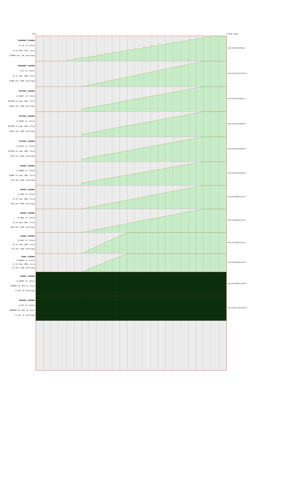

# SIENNA

* `docs`      - documentation generation
* `deployer`  - deploy scripts
* `optimizer` - build tool
* `token`     - standard SNIP20 token
* `mgmt`      - vesting management contract
* `fadroma`   - smart contract macro library
* `kukumba`   - BDD macro library

## Quick start

Make sure you're familiar with the `docs`, then use the `deployer` to
upload a build (produced by the `optimizer`) of the `token` and `mgmt`
contracts (the latter of which is built with `fadroma` and tested with 
`kukumba`).

```
git clone --recurse-submodules git@github.com:hackbg/sienna-secret-token.git sienna
cd sienna
cargo test
make
ls dist/
./deployer/deploy.js
```

## Vesting schedule


