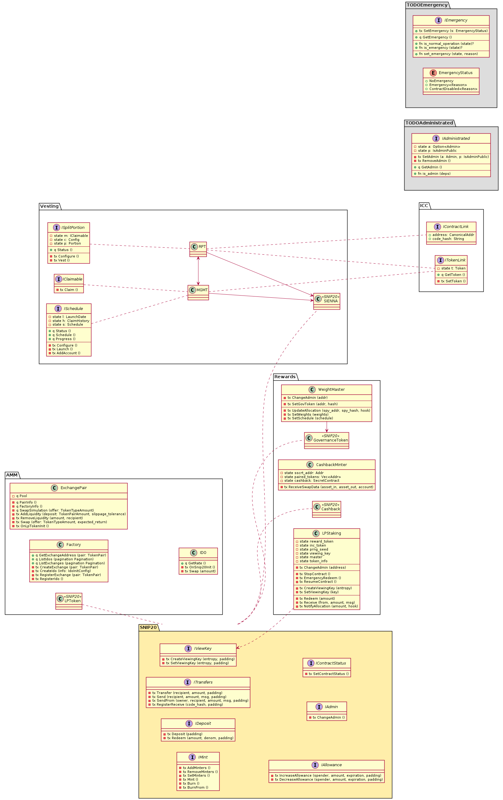

# SIENNA

## Quick start

Here's how to fetch the code, install JS dependencies,
and obtain a list of the actions you can perform:

```sh
git clone --recurse-submodules git@github.com:hackbg/sienna-secret-token.git sienna 
cd sienna
yarn
./sienna.js --help
```

```
sienna.js <command>

Commands:
  sienna.js test                                   ⚗️  Run test suites for all the individual components.
  sienna.js ensure-wallets                         ⚗️  Ensure there are testnet wallets for the demo.
  sienna.js demo [--testnet]                       ⚗️  Run integration test/demo.
  sienna.js build                                  👷 Compile contracts from working tree
  sienna.js schema                                 🤙 Regenerate JSON schema for each contract's API.
  sienna.js docs [crate]                           📖 Build the documentation and open it in a browser.
  sienna.js coverage                               ⚗️  Generate test coverage and open it in a browser.
  sienna.js config [<spreadsheet>]                 📅 Convert a spreadsheet into a JSON schedule
  sienna.js deploy                                 🚀 Build, init, and deploy (step by step with prompts)
  sienna.js upload <network>                       📦 Upload compiled contracts to network
  sienna.js init <network> [<network>]             🚀 Just instantiate uploaded contracts
  sienna.js launch <deployment>                    🚀 Just launch initialized contracts
  sienna.js configure <deployment> <schedule>      ⚡ Upload a JSON config to an initialized contract
  sienna.js reallocate <deployment> <allocations>  ⚡ Update the allocations of the RPT tokens
  sienna.js add-account <deployment> <account>     ⚡ Add a new account to a partial vesting pool

Options:
  --help     Show help  [boolean]
  --version  Show version number  [boolean]
```

## Overview

This UML diagram may not be 100% true to the current implementation,
however it provides an accurate overview of the system's intent.


