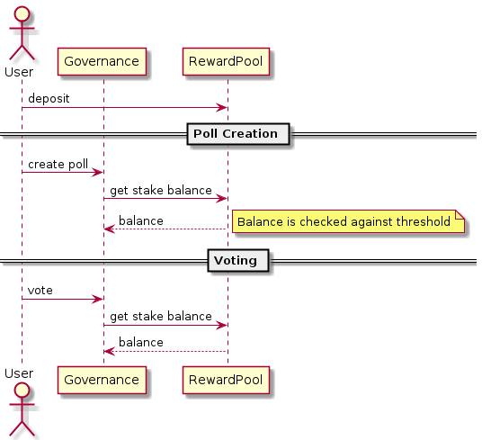

# Sienna Governance
  
## Conceptual overview
Sienna Governance serves the purpose of applying changes to the network based on the opinions of stake holders.  
Stake holders can create text based polls and other holders can vote on them.  
      
* The voting power of a user is dependent on the total amount of staked tokens in the rewards pool (his balance is added to the votes)
* There are no consequences of polls failing
* User can vote in any number of polls  
* User can stake more tokens to update his voting power
* All the votes are private
  
As the polls are purely text based, any changes are left to the admin to change. There are currently no automatically executed messages after the poll is complete.  
   
Updating the polls is event based and has the following limitations: 
- User cannot unstake while their vote is active in an on-going poll
- A user(stake holder) can only create a poll if their staked balance is higher than the configured threshold
- If a user has not voted in any on going polls, but a poll they created is active, they can only unstake up to the threshold. Meaning his balance must never go below the threshold while the created poll is active

Updating of all active polls occurs when a stake holder stakes or unstakes (*according to the limitations*) tokens. All non expired polls will then be updated with the new voting power and the result will be recalculated. 
## Configuration
* threshold - the minimum amount of tokens needed in order to create a poll (defaults to 3500)
* quorum - minimum percentage of voting power that needs to be casted on a proposal for the result to be valid. (value between 0 and 1, defaults to 0.3)
* deadline - the amount of time, in seconds, a poll lasts. Expiration is then set as current_time + deadline (defaults to 7 days)
## Privacy model
| Data           | Public                       |
| ---------------| -----------------------------|
| Polls          | Yes                          |
| Poll Results   | Yes                          |
| Votes          | No (except with viewing key) |
## Control flows´
### User flow  
High level flow overview
  

When a user votes in a poll his balance is checked and his voting power is registered for the given poll
This causes the result to be (re)calculated according to this formula:
```
tallied vote power = yes votes + no votes
tally = tallied vote power / total staked in pool

result = participation > quorum
```

## Docs  
The entirety of governance is saved into the following data structures  
  
Polls: 
```rust
pub struct Poll {
    pub id: u64, //
    pub creator: CanonicalAddr,
    pub metadata: PollMetadata,
    pub expiration: Expiration,
    pub status: PollStatus,
    pub current_quorum: Decimal,
}
pub struct PollMetadata {
    pub title: String,
    pub description: String,
    pub poll_type: PollType,
}
```
Poll results: 
```rust
pub struct PollResult {
    pub poll_id: u64,
    pub yes_votes: Uint128,
    pub no_votes: Uint128,
}
```

Votes: 
```rust
pub struct Vote {
    pub choice: VoteType,
    pub power: Uint128,
    pub voter: CanonicalAddr,
}
```

Temporary user information:
```rust

pub struct User {
    pub active_polls: Vec<u64>,
    pub created_polls: Vec<u64>,
}
```
### Storage keys 
Each structure has its own functions for reading and writing the data to storage. Data that is never read on its own but along with some other data is serialized together. 
All of the properties of the structures are saved separately under a unique key. The structure of the key is some unique name + the id of the poll.   
### Poll ID
As one of the main keys used in saving data to storage is the poll id, this has been automated to be an auto increment index. 
### Usecase
- Poll  + PollMetadata  
The purpose of this structure is to save the raw data for each poll. The data itself is also *almost* fully static. The only part that is updated is the status of the poll. No further updates should be allowed on this data. 
- Vote + PollResult  
The vote struct is used to save information about every single vote that exists. This data is meant to be private. The votes themself are saved under *base namespace* + *poll id* + *user address*. This means that read time is always O(1), with the added drawback that there is no way to iterate over every vote on a poll.  
- User  
Because of the above drawback of not being able to iterate over votes on a poll, as well as the necessity to save up on gas fee, there's a need to temporarily store the ids of the polls user has either voted on or created. (Check the limitations list for more info)  
This temporary data is always updated on any update from the user. Each poll which has expired is removed from the list. 