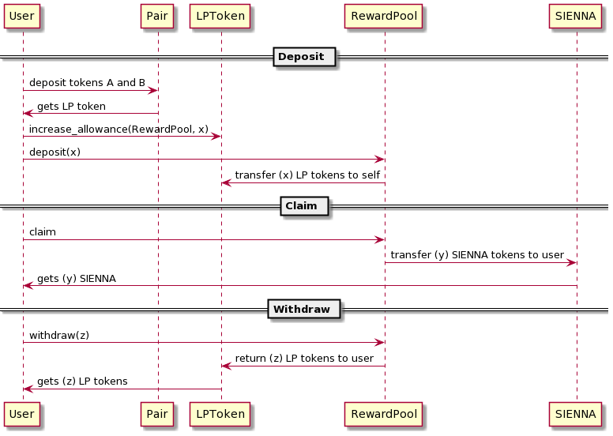
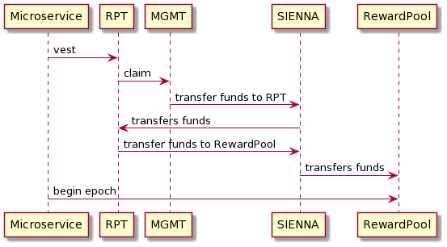
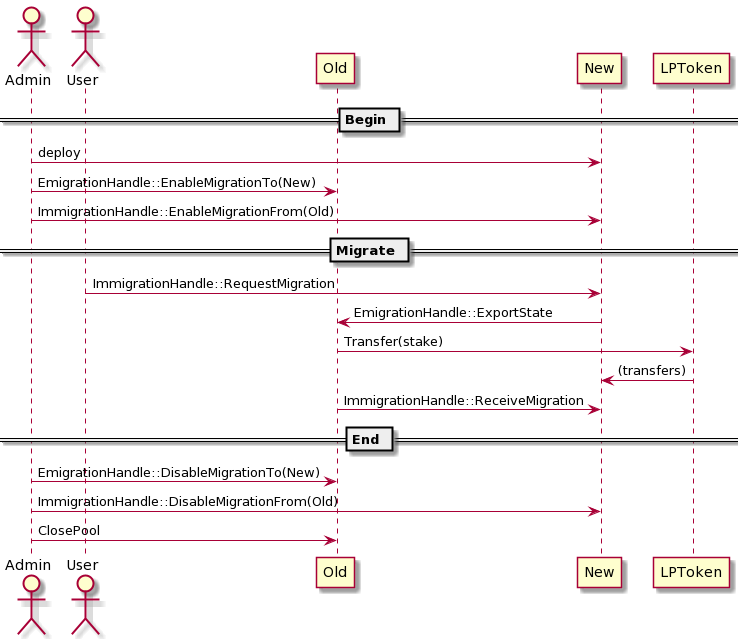

# Sienna Rewards

Sienna Rewards distributes SIENNA tokens to users
who provide liquidity for Sienna Swap.

* The amount of liquidity that users may provide is
  unbounded, while the amount of rewards is pre-defined
  as part of the TGE budget in `/settings/schedule.json`.

* Therefore, an algorithm must be devised to split that
  budget among users in proportion to their liquidity
  contribution over time.

The main thing to understand about this algorithm is
that it works primarily in **event time**:

* The continously shifting distribution of rewards among users
  is updated upon each transaction, based on the elapsed linear time
  since the previous transaction.

* Time does not pass in absence of user activity; status queries
  require the current time to be provided by the user. If the time
  provided by the user is before the time of last update, the query
  fails.

## User flow



When a user provides tokens `XXX` and `YYY` to a
liquidity pool, a LP token `LP_XXX_YYY` is minted
to that user.

* The user can then deposit the LP token
  into the reward pool via the transaction:

```json
{"rewards":{"deposit":{"amount":"1"}}}
```

* This causes the reward pool to transfer 1 unit of LP_TOKEN
  from the user's balance to itself.

* From this point on, `volume` begins to accumulate:

```
user volume = user stake * time elapsed
pool volume = sum of all user stakes * time elapsed
```

After a configurable `bonding` period, the user
is eligible to `claim` the rewards:

```json
{"rewards":{"claim":{}}}
```

* If this user was the only one who staked tokens
  during that period, they get the full rewards `budget`
  for that period.

* If multiple users stake tokens, the proportion of
  the rewards that they earn is computed using the
  following formula:

```
  user volume
/ pool volume that has accumulated since T0
* reward budget that has vested since T0
```

T0 is defined as follows:

* When the user deposits, T0 is set to
  **the start of the current epoch**.

* When the user claims, T0 is reset to
  **the current time**.

When the user leaves the pool by withdrawing all LP tokens,
the state of the user is reset.

* If the user leaves the pool after the bonding period,
  rewards are auto-claimed.

* If the user leaves the pool before the bonding period,
  their contribution is reset and no rewards are claimed.

## Epoch flow



Rewards are vested to the pool via the RPT contract
(`/contracts/rpt`) daily. This increments an internal counter
referred to as the **epoch clock**.

* The epoch clock is incremented by the same periodic job
  that calls `{"vest"{}}` on the RPT contract.

* Unclaimed reward budget can be manually retrieved
  and more epochs can be launched after the end of the
  rewards program if it is so desired.

## Migration flow

To migrate:

1. Deploy next version of contract
2. Enable migration to new contract in old contract
3. Enable migration from old contract in new contract
4. Each user calls RequestMigration to move from old to new contract
5. When migration window is over, call ClosePool on old contract


